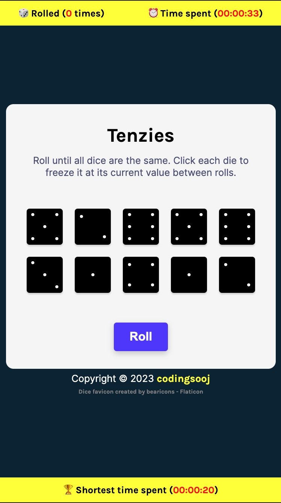
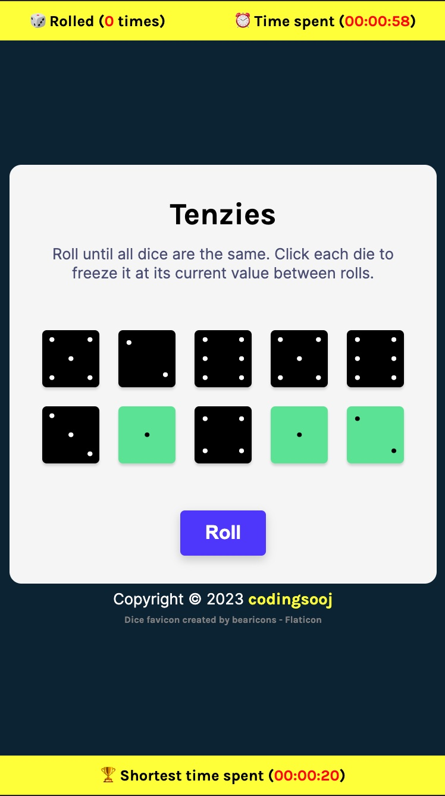
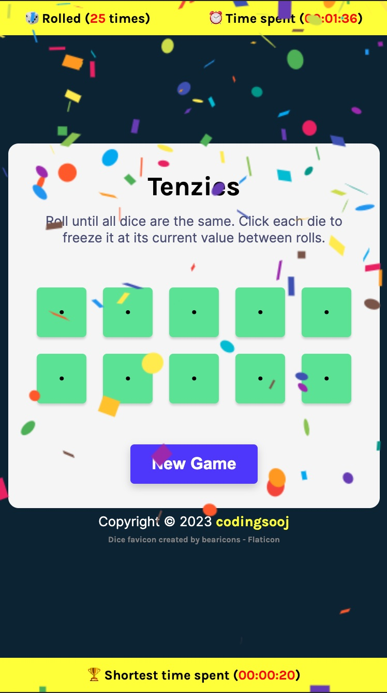

# Tenzies

A quick and simple game of Tenzi built with React.

## Table of contents

- [Overview](#overview)
  - [Screenshots](#screenshots)
  - [Demo Link](#demo-link)
- [About the Project](#about-the-project)
  - [Status](#status)
  - [Built with](#built-with)
  - [Reflection](#reflection)
- [Author](#author)

## Overview

### Screenshots

Demo video:

Screenshots (mobile version):





### Demo Link

**[💻 Live Site URL](https://tenzies-spark.netlify.app/)**

## About the Project

### Status

✅ Completed & Deployed

### Built with

- HTML
- CSS
- React
- Vite

### Reflection

This was a week long project built from scratch while taking the fourth module of Learn React for Free course by Bob Ziroll on Scrimba. Project goals included using React skills learned including React hooks like useState and useEffect.

I added the following extra features not covered in the lecture:

- making dice with dots with CSS to use instead of dice with Arabic numerals
- tracking the number of rolls made to win the game
- tracking the time it took to win the game
- saving and bringing locally stored best time to display using localStorage
- responsive web design

One of the main challenges I ran into was saving and tracking the best time to win the game. Originally, I was trying to save all of the times tracked into an array in the localStorage, but realized that the purpose of keeping track of the time in my app was to renew the best time. Therefore, I decided to renew the time saved in the localStorage only when the time is shorter than the one already saved. This decision made the process simpler and fulfilled the goal of tracking only the best time.

One interesting CSS property I learned to use while replacing the Arabic numerals from the die faces with corresponding number of dots is the `grid-template-areas`. Using string and dot notation to create cells and assigning names for each cell made it much easier to style the die faces.

```css
.die-face {
  width: 3rem;
  height: 3rem;
  box-shadow: 0px 2px 2px rgba(0, 0, 0, 0.15);
  border-radius: 3.81277px;
  cursor: pointer;

  display: grid;
  grid-template-areas: "a . c" "e g f" "d . b";
  align-items: center;
}

.dot:nth-child(2) {
  grid-area: b;
}
.dot:nth-child(3) {
  grid-area: c;
}
.dot:nth-child(4) {
  grid-area: d;
}
.dot:nth-child(5) {
  grid-area: e;
}
.dot:nth-child(6) {
  grid-area: f;
}
.dot:nth-child(odd):last-child {
  grid-area: g;
}
```

The technologies implemented in this project are React, HTML, JavaScript, JSX, and CSS. I chose to use Vite boilerplate to minimize initial setup and invest more time into creating component functions that made what I intended actually work.

## Author

Soojeong Park [@codingsooj](https://twitter.com/codingsooj)
